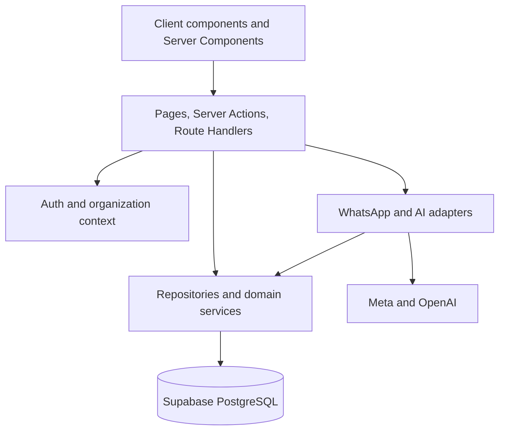
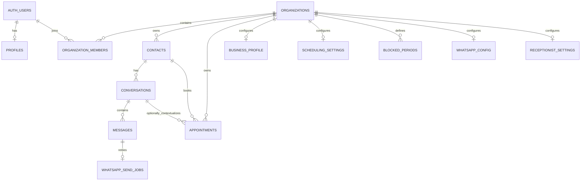

# Detailed Low-Level Design

## 1. Repository and module layout

```text
app/
  api/health/                         liveness endpoint
  api/whatsapp/webhook/               Meta verification and event ingress
  api/internal/whatsapp/retry/        authenticated retry worker ingress
  auth/                               callback, login, logout, signup
  dashboard/                          protected operator UI
components/                           client forms and navigation
lib/
  auth/                               auth actions and validation
  config/                             environment contract
  domain/                             tenant-scoped repositories and services
    appointments/                     appointment engine and rules
    business/                         business configuration repository
    contacts/                         contact repository
    conversations/                    conversation repository
    messages/                         message repository
  organizations/                      membership and organization context
  supabase/                           browser, SSR, service/database clients
  ai/                                 classification, state, planning, tools
  whatsapp/                           provider adapter and reliability pipeline
types/                                generated and shared TypeScript types
supabase/migrations/                  ordered PostgreSQL schema and policy changes
tests/                                unit, integration/RLS, and Playwright E2E
```

### Import rules

- Browser components may use the browser Supabase client only.
- Server components, actions, and route handlers use the SSR client.
- `server-only` modules cannot be imported into client components.
- Provider secrets and the service-role key are confined to server-only WhatsApp paths.
- AI modules do not import Supabase or WhatsApp modules for classification/state/planning.
- AI tools delegate to the authoritative appointment operations; they do not duplicate scheduling rules.

## 2. Runtime layers



## 3. Database model

The exact schema is defined by ordered migrations in `supabase/migrations/`. The logical model is:



### Core records

- `profiles`: application profile linked to `auth.users`.
- `organizations`: tenant identity, slug, and business profile fields.
- `organization_members`: user membership and constrained role.
- `contacts`: organization-owned customer identities, including phone numbers.
- `conversations`: organization/contact/channel conversation state.
- `messages`: inbound/outbound content, provider correlation, and delivery state.
- `appointments`: contact-linked appointment lifecycle with UTC instants.
- `organization_scheduling_settings`: business hours, IANA timezone, and default duration.
- `organization_blocked_periods`: organization-owned unavailable time ranges.
- `organization_whatsapp_configs`: safe provider metadata only.
- `organization_whatsapp_secret_refs`: Vault references, inaccessible to client roles.
- `organization_receptionist_settings`: bounded tenant-authored instructions and FAQ.
- `whatsapp_send_jobs`: durable retry state, lease, attempt count, and next-attempt time.

Every organization-owned row has `organization_id` and same-tenant composite relationships where required. Timestamps are `timestamptz` and database-generated.

## 4. Authorization design

1. Supabase Auth establishes the authenticated user.
2. Organization context reads memberships using the SSR anon client.
3. The selected organization is a preference only; membership is revalidated.
4. Repositories derive organization context and do not accept caller tenant IDs.
5. PostgreSQL RLS checks membership for reads and role-sensitive mutations.
6. Server-side role checks provide an additional application boundary.
7. Service-role operations are limited to trusted WhatsApp correlation/retry paths and never used as a substitute for tenant authorization.

RLS is enabled on all public tables. `organization_whatsapp_secret_refs` and `whatsapp_send_jobs` intentionally have no `anon` or `authenticated` policies.

## 5. HTTP and route contracts

### Health

`GET /api/health`

- Returns application liveness only.
- Does not call the database, Meta, or OpenAI.
- Use it for deployment/load-balancer checks, not dependency readiness.

### WhatsApp webhook

`GET /api/whatsapp/webhook`

- Resolves configuration from the verified routing boundary.
- Validates the Meta verify token and returns the challenge.
- Does not expose Vault data.

`POST /api/whatsapp/webhook`

- Reads the raw request body.
- Extracts only an untrusted phone-number routing hint.
- Resolves active configuration server-side.
- Verifies `X-Hub-Signature-256` HMAC before parsing/persisting.
- Persists verified inbound text and status events through the pipeline.
- Returns `403` for invalid signatures and `500` for persistence failures.
- Acknowledges verified duplicates, stale events, and unknown events deterministically.

### Retry worker

`POST /api/internal/whatsapp/retry`

- Requires a bearer secret compared with a timing-safe comparison.
- Accepts no tenant, provider, or message identity from the caller.
- Claims due jobs server-side and returns aggregate processing information without internal error detail.
- Is disabled when `WHATSAPP_RETRY_WORKER_SECRET` is unset.

## 6. Appointment engine contract

The appointment engine is the sole owner of appointment mutations:

- Create validates local date/time, converts to UTC using organization timezone, checks business hours, blocked periods, duration, and conflicts.
- Reschedule revalidates ownership and handles self-conflict correctly.
- Cancellation uses a dedicated transition boundary.
- Query is organization/contact scoped and returns bounded mapped records.
- Status transitions prevent invalid terminal-state changes.
- AI tools call these operations rather than writing appointment rows directly.

The current model has no staff, service, or resource selection. Those concepts must be added through a reviewed domain change, not guessed in the AI layer.

## 7. WhatsApp reliability design

### Inbound

- Contact resolution is organization scoped.
- One open WhatsApp conversation exists per organization/contact/configuration.
- Provider message ID has tenant-scoped uniqueness.
- Duplicate events return a stable duplicate result and do not insert a second message.
- Concurrent duplicates converge through transaction locking and uniqueness constraints.

### Delivery states

Outbound messages use a monotonic state machine:

```text
pending -> sent -> delivered -> read
pending -> failed
sent -> failed
```

- Duplicate callbacks are ignored.
- Regressions are ignored as stale.
- A delivered/read message cannot become failed.
- Inbound messages do not receive outbound delivery status.

### Retry jobs

- States: `pending`, `processing`, `completed`, `dead`.
- Claim uses `FOR UPDATE SKIP LOCKED` and a five-minute lease.
- Claim increments attempts before send, including worker-crash attempts.
- Five attempts maximum; exponential full-jitter backoff, 30-second base, one-hour cap.
- HTTP 429 honors the greater of `Retry-After` and calculated backoff, capped at one hour.
- Retryable failures create one job; permanent failures create none.
- Ambiguous outcomes become `unconfirmed` and are not automatically retried.

## 8. AI receptionist design

### Classification

- Seven intents: booking, rescheduling, cancellation, query, general question, greeting, unknown.
- Strict Zod parsing rejects unsupported values and extra keys.
- Provider failure, malformed output, low-signal input, and unknown intent require clarification.
- The customer message is delimited untrusted data; the model cannot override system instructions or use tools.

### State and planning

- State is derived from the authenticated organization, conversation, contact, and latest inbound message.
- History is bounded to the latest 20 messages in chronological order.
- The latest inbound message is classified even if outbound messages are newer.
- Scheduling planning extracts only local date/time and safe appointment context references.
- Timezone comes from organization scheduling settings; DST ambiguity/nonexistence requests clarification.
- Planning is read-only.

### Tool execution

- Exactly four tools: book, reschedule, cancel, query.
- Tool choice is deterministic from the validated plan; the model is not involved in execution.
- Organization and contact are derived server-side.
- Appointment references resolve against the trusted contact's pending/confirmed records by local date/time; zero or multiple matches do not mutate.
- Results are discriminated and expose only safe domain codes.
- No reply generation or webhook wiring is currently performed by the AI layer.

## 9. Error handling

- Zod validation failures map to stable validation responses.
- Database/provider details are translated into typed domain or integration errors.
- Public responses contain safe error codes and generic messages.
- Logs may contain operational context but must not contain credentials, Vault values, raw provider secrets, or untrusted full payloads unless explicitly scrubbed.
- Retry classification distinguishes retryable, ambiguous, and permanent failures.

## 10. Test layers

- Unit tests cover validation, intent contracts, state/planning/tool behavior, retry policy, and static security boundaries.
- Integration tests cover Supabase schema, RLS, domain behavior, WhatsApp pipeline/reliability, AI state/planning/tools, and business configuration.
- Playwright covers browser workflows such as authentication, dashboard, contacts, conversations, and appointments.
- CI runs lint, typecheck, unit tests, build, and a fresh local Supabase migration/RLS integration job.
