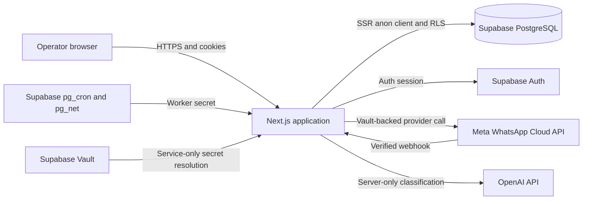

# High-Level Design

## 1. Purpose

The AI Customer Operations Platform is a multi-tenant SaaS application for managing customer contacts, conversations, appointments, business settings, and WhatsApp operations. The first vertical is clinics, but the foundation uses generic organizations, contacts, services-ready configuration, conversations, and appointments so future verticals do not require a platform rewrite.

This document describes the current implemented design. It does not describe unimplemented AI automation, billing, or future microservices.

## 2. Goals

- Provide a secure organization and membership boundary.
- Support authenticated operators through a protected dashboard.
- Store contacts, conversations, messages, appointments, and business configuration.
- Receive and send WhatsApp Cloud API messages through a controlled server boundary.
- Preserve message idempotency, delivery status, retry state, and tenant isolation.
- Prepare deterministic AI scheduling actions without allowing a model to authorize mutations.
- Keep the system deployable as one modular monolith.
- Make future domain modules addable without weakening RLS or server/client boundaries.

## 3. Non-goals in the current release

- No billing or subscription management.
- No automatic natural-language reply generation.
- No WhatsApp template-message workflow.
- No escalation-rule engine.
- No service, staff, resource, or clinic-specific scheduling model beyond the implemented appointment domain.
- No exactly-once provider delivery guarantee; ambiguous provider outcomes are marked `unconfirmed`.
- No in-process rate limiter; rate limiting belongs at the deployment edge.
- No microservices, Kafka, Redis, or Kubernetes.

## 4. Architectural style

The system is a **modular monolith**:

- One Next.js deployable contains the UI, server components, server actions, and route handlers.
- Supabase PostgreSQL is the durable system of record.
- Supabase Auth owns user identity and sessions.
- PostgreSQL RLS is the authoritative tenant authorization boundary.
- Server-only modules own privileged provider and service-role operations.
- Domain repositories and services isolate business rules from pages and transport adapters.

## 5. Major components

### 5.1 Web application

The `app/` directory contains the App Router pages and route handlers. It provides:

- Public landing and authentication pages.
- Onboarding and organization selection.
- Protected dashboard pages for contacts, conversations, appointments, and settings.
- `/api/health` for application liveness.
- `/api/whatsapp/webhook` for Meta verification and inbound/status events.
- `/api/internal/whatsapp/retry` for the authenticated durable retry worker.

### 5.2 Authentication and tenant context

Supabase Auth authenticates the user. `organization_members` authorizes access to an organization. Server-side organization context revalidates membership on every request and does not treat a client organization ID or preference cookie as proof of access.

Roles are `owner`, `admin`, and `member`. Database policies and server-side checks enforce role-sensitive writes.

### 5.3 Domain layer

`lib/domain/` contains organization-scoped repositories, validation, typed errors, business configuration, contacts, conversations, messages, and appointments. Repositories use the authenticated SSR client and explicit allowed fields. Appointment services own availability, time zone, conflict, status, and concurrency rules.

### 5.4 WhatsApp integration

`lib/whatsapp/` contains configuration resolution, Meta request handling, signature validation, inbound normalization, outbound sending, delivery reconciliation, failure classification, retries, and pipeline orchestration.

Provider access tokens, app secrets, and verify tokens are resolved from Supabase Vault through service-only functions. They are never accepted from a browser request or returned to a client.

### 5.5 AI receptionist core

`lib/ai/` contains a server-only provider boundary, strict intent classification, derived conversation state, scheduling conversation planning, extraction, and deterministic appointment tools. The model may classify or extract data, but it cannot select a tenant, provide an appointment identifier, call a tool, or mutate the database.

### 5.6 Database and operations

Supabase PostgreSQL stores all durable records and enforces RLS, constraints, foreign keys, and security-definer boundaries. `whatsapp_send_jobs` supports durable retry. `pg_cron` and `pg_net` invoke the internal retry endpoint when production Vault configuration is present.

## 6. Primary user journeys

### Operator journey

1. User signs up or logs in through Supabase Auth.
2. Middleware and server context validate the session.
3. User creates or selects an authorized organization.
4. User operates contacts, conversations, appointments, and business settings in the protected dashboard.
5. RLS prevents access to another organization's records.

### Inbound WhatsApp journey

1. Meta sends a webhook request.
2. GET verification resolves the tenant configuration and validates the challenge.
3. POST extracts only a routing hint, resolves configuration server-side, verifies the raw-body HMAC, and acknowledges invalid signatures with `403`.
4. A verified inbound text event is normalized.
5. The pipeline resolves or creates the organization-scoped contact and open conversation.
6. The inbound message is inserted once using provider-message idempotency.
7. A fresh supported Meta inbound message creates one durable AI-processing job and the webhook acknowledges without waiting for model or provider work.
8. The worker runs shared orchestration; outbound replies use the durable reserve/send/correlate path and the existing delivery retry worker.

### Outbound and retry journey

1. A trusted server operation reserves an outbound message row.
2. The provider request is sent using Vault-resolved configuration.
3. The result is correlated to the existing message row.
4. Safe retryable failures create one durable send job.
5. The worker claims jobs with a lease and `SKIP LOCKED`, retries with bounded jittered backoff, or retires a job as `dead`.
6. Ambiguous outcomes remain `unconfirmed` and are not retried automatically.

## 7. Quality attributes

- **Security:** RLS, strict server/client separation, HMAC webhook validation, timing-safe worker authentication, safe errors, fixed search paths, and secret isolation.
- **Reliability:** idempotent inbound persistence, monotonic delivery states, durable retry jobs, lease recovery, bounded attempts, and explicit ambiguous outcomes.
- **Scalability:** stateless Next.js instances, managed PostgreSQL, and tenant-scoped indexes; edge rate limiting is required before high-volume production use.
- **Maintainability:** TypeScript strict mode, modular domains, Zod contracts, migrations, unit/integration/E2E tests, and CI.
- **Observability:** health endpoint, application logs, delivery/job state inspection, and deployment verification runbook. A full audit/event platform is future work.

## 8. Key decisions

| Decision                                     | Reason                                                                                                                 |
| -------------------------------------------- | ---------------------------------------------------------------------------------------------------------------------- |
| Modular monolith                             | Keeps the current product simple while preserving domain boundaries.                                                   |
| Supabase Auth plus PostgreSQL RLS            | Identity and tenant authorization are separate, database-enforced concerns.                                            |
| Service role only for trusted WhatsApp paths | Prevents browser or ordinary tenant queries from bypassing RLS.                                                        |
| Vault for provider secrets                   | Keeps tokens and signing secrets out of code, client payloads, and environment variables.                              |
| Deterministic AI tool selection              | A model cannot directly authorize an appointment mutation.                                                             |
| `unconfirmed` for ambiguous sends            | The WhatsApp text API does not expose a client idempotency key, so automatic retry could duplicate a customer message. |
| No application rate limiter                  | In-memory limits are unsafe across instances; use an edge/shared limiter at deployment.                                |
