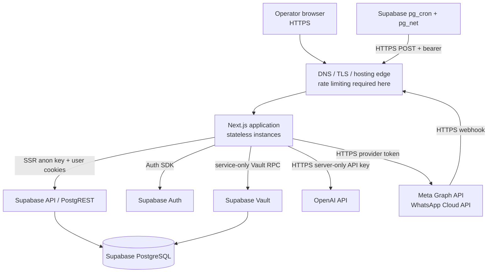
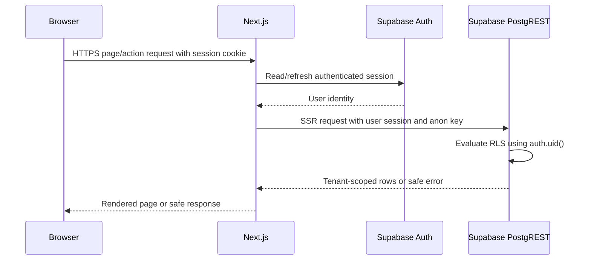
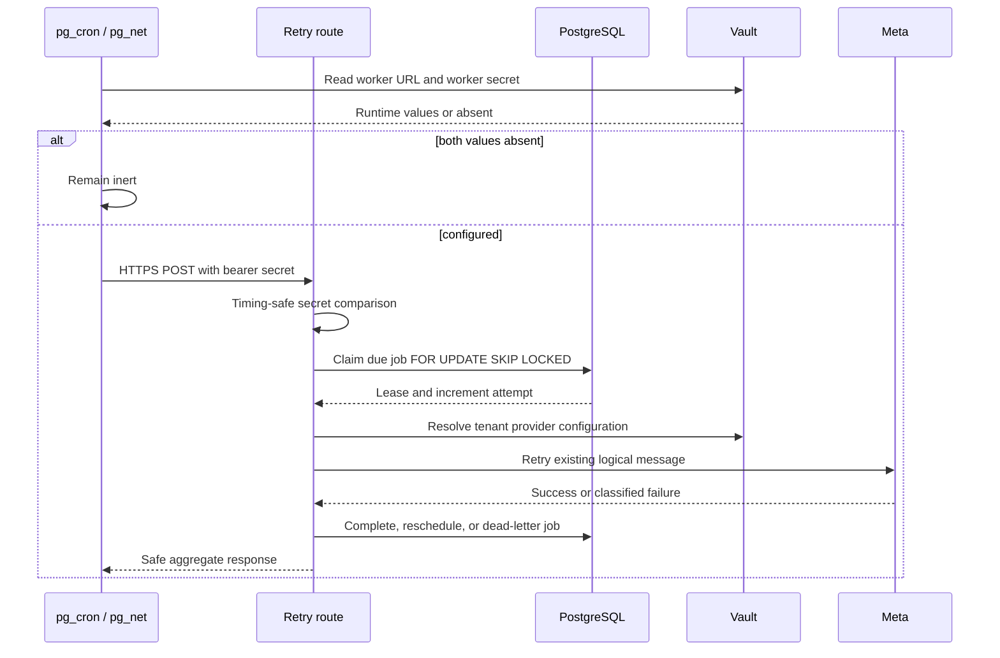

# Network Architecture and Data Flow

## 1. Scope

This document describes the network and trust boundaries for the current modular monolith. The selected hosting platform is intentionally not hard-coded; the application can run on a Next.js-compatible host with Supabase as the managed data platform.

## 2. Logical topology



## 3. Trust zones

| Zone                  | Components                                           | Trust level       | Controls                                                                                     |
| --------------------- | ---------------------------------------------------- | ----------------- | -------------------------------------------------------------------------------------------- |
| Public/untrusted      | Browser, Meta webhook payload, customer message text | Untrusted         | HTTPS, input validation, HMAC verification, React escaping, no caller tenant IDs.            |
| Application           | Next.js pages, actions, route handlers               | Controlled        | Auth/session checks, server-only imports, typed contracts, safe errors.                      |
| Tenant data           | Supabase PostgreSQL tables                           | Sensitive         | RLS, organization-scoped queries, constraints, same-tenant foreign keys.                     |
| Privileged operations | Service-role client, Vault functions, retry worker   | Highly restricted | Server-only modules, no public execute grants, timing-safe worker secret, narrow procedures. |
| External providers    | Meta and OpenAI                                      | Third-party       | Explicit request schemas, no secret leakage, failure classification, response reduction.     |

## 4. Network rules and ports

- Public application traffic: TCP 443 only in production.
- Local Next.js development: TCP 3000 by default.
- Supabase services are accessed over HTTPS through the Supabase project URL.
- OpenAI and Meta are accessed only by server-side code over HTTPS.
- No direct browser-to-Meta provider request is allowed for application messaging.
- No database port is exposed by the application; database access is through Supabase clients/functions.
- The internal retry endpoint is still HTTPS-public at the transport layer, but requires a high-entropy bearer secret and does not accept tenant selection input.
- Configure platform edge rate limiting before high-volume production traffic. The application intentionally does not use process-local rate limiting.

## 5. Browser request flow



The browser may hold the public Supabase URL and anon key, but those values do not grant access. RLS and authenticated session claims are the authorization boundary.

## 6. Inbound WhatsApp data flow

```mermaid
sequenceDiagram
    participant M as Meta
    participant W as Webhook route
    participant V as Vault/config boundary
    participant P as Pipeline
    participant D as PostgreSQL
    participant AI as AI planning modules

    M->>W: GET verification challenge
    W->>V: Resolve active config by routing boundary
    V-->>W: Verify-token reference/value inside server boundary
    W-->>M: Challenge or rejection

    M->>W: POST raw event + X-Hub-Signature-256
    W->>W: Extract untrusted phone hint
    W->>V: Resolve organization config server-side
    V-->>W: App secret/config metadata
    W->>W: Verify HMAC over raw body
    alt invalid signature
        W-->>M: 403; no persistence
    else valid signature
        W->>P: Normalize trusted event
        P->>D: Resolve/create tenant-scoped contact
        P->>D: Resolve/create open conversation
        P->>D: Insert message under provider-id uniqueness
        D-->>P: Inserted or stable duplicate result
        P-->>W: Deterministic acknowledgement
        W->>AI: Optional state/planning/tool boundary
        AI-->>W: Structured result only; no generated reply
        W-->>M: 200 acknowledgement
    end
```

### Input trust rules

- The phone-number routing hint is never treated as authorization.
- Raw body signature verification occurs before trusting the event payload.
- Customer text is untrusted data for AI classification and extraction.
- Provider message IDs are correlation keys, not tenant selectors.

## 7. Outbound WhatsApp data flow

```mermaid
sequenceDiagram
    participant S as Trusted server operation
    participant D as PostgreSQL
    participant V as Vault
    participant W as WhatsApp module
    participant M as Meta

    S->>D: Reserve outbound message in tenant context
    W->>V: Resolve active config and access token
    V-->>W: Provider secret inside server boundary
    W->>M: HTTPS text message request
    alt accepted and correlated
        M-->>W: Provider message ID
        W->>D: Correlate existing row; set sent
    else retryable failure
        W->>D: Set failure classification
        W->>D: Create/reuse one retry job
    else ambiguous outcome
        W->>D: Set unconfirmed; no automatic retry
    else permanent failure
        W->>D: Record failed; no retry job
    end
```

Meta status callbacks later advance `sent -> delivered -> read` or apply `failed` only before delivery. Stale and duplicate callbacks are ignored.

## 8. Retry-worker data flow



A retry never creates a second logical message row. A worker crash consumes an attempt because attempts increment at claim time.

## 9. AI data flow and minimization

1. The latest inbound message is selected from a bounded 20-message conversation window.
2. Only the required text and bounded conversation state are given to the server-only AI boundary.
3. The model receives a classification/extraction prompt with customer content delimited as untrusted data.
4. Strict Zod parsing reduces the response to a known internal contract.
5. Provider errors, malformed output, and low-signal text become clarification/unknown outcomes.
6. Tool arguments are derived from trusted conversation/contact state and validated again.
7. Appointment tools use existing domain services; raw rows and infrastructure errors are not exposed.

Business instructions and FAQ are stored as tenant-authored data but are not yet injected into AI prompts.

## 10. Data classification and retention guidance

| Data                                      | Classification                    | Allowed locations                                                 |
| ----------------------------------------- | --------------------------------- | ----------------------------------------------------------------- |
| Auth session cookie                       | Sensitive                         | Secure HTTP-only cookie and Supabase Auth.                        |
| Supabase URL/anon key                     | Public configuration              | Browser and server environment. RLS remains mandatory.            |
| Service-role key                          | Secret                            | Server deployment secret only.                                    |
| Meta access token/app secret/verify token | Secret                            | Supabase Vault only.                                              |
| Worker secret                             | Secret                            | Deployment secret and matching Vault entry.                       |
| Customer phone/message content            | Tenant-sensitive                  | Tenant-scoped PostgreSQL rows and necessary provider/AI requests. |
| Appointment and business settings         | Tenant-sensitive                  | Tenant-scoped PostgreSQL rows.                                    |
| Provider message ID/status                | Tenant-sensitive operational data | Tenant-scoped message/reliability records.                        |

Do not log secrets, raw authorization headers, Vault contents, complete webhook bodies, or unnecessary customer content. Configure provider and platform retention according to the production data policy before launch.

## 11. Failure boundaries

- Invalid webhook signature: reject at the application edge before persistence.
- Unknown/stale/duplicate verified event: acknowledge safely and do not repeat side effects.
- Database persistence failure: return `500` so the provider can retry; never misreport it as a signature failure.
- Provider timeout/connect failure: classify as retryable or ambiguous based on whether acceptance is known.
- OpenAI unavailable: return an unknown/clarification result; do not mutate appointments.
- Unauthorized tenant access: RLS or server context rejects the operation.
- Missing retry Vault configuration: cron invoker is intentionally inert.
